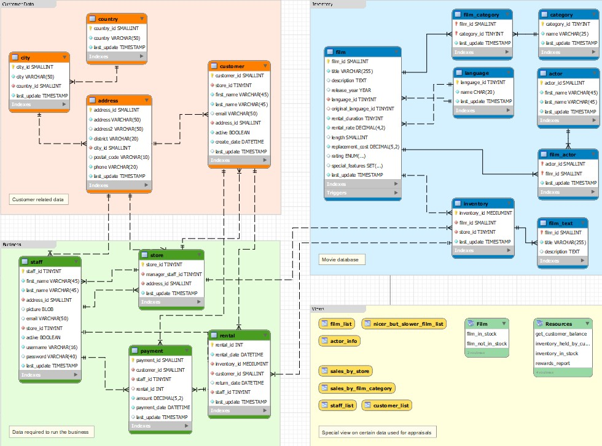

# bda-modulo-2-evaluacion-final-ValeFischer
Evaluación Final Módulo 2

Para este ejerccio utilizaremos la BBDD Sakila, la cual simula una tienda de alquiler de películas. Contiene tablas como film (películas), actor (actores), customer (clientes), rental (alquileres), category (categorías), entre otras. Estas tablas contienen información sobre películas, actores, clientes, alquileres y más, y se utilizan para realizar consultas y análisis de datos en el contexto de una tienda de alquiler de películas.

